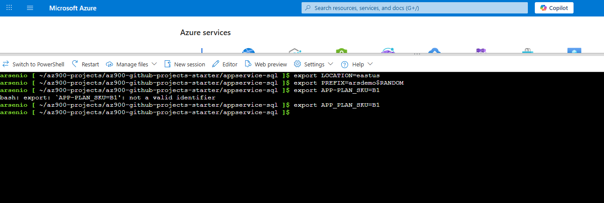
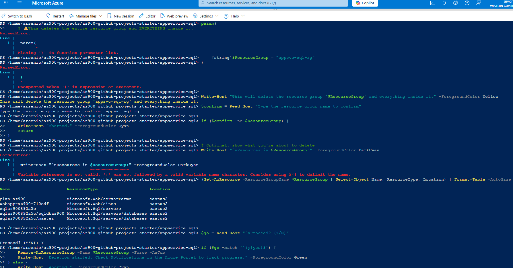

# App Service + Azure SQL (PaaS)

**Goal:** Deploy a Linux App Service running a sample Node app and provision an Azure SQL database. Set the DB connection string as an app setting.

## Steps
1. `bash deploy.sh` — creates App Service plan + Web App + SQL server/db; deploys sample app via ZIP.
2. Script prints the web app URL. Visit it to verify the app is running.
3. (Optional) Connect your app code to SQL using the `SQLCONNSTR_DefaultConnection` setting.
4. `bash cleanup.sh` when done.

## What you learn
- PaaS web hosting vs. IaaS.
- App settings and deployment methods (zip deploy).
- Basic database provisioning and firewall rules.

## 📸 Screenshots

### 1) Setup

### 2) Make scripts executable

### 3) Deploy resources

### 4) Test in browser

### 5) Azure Portal – Resource Group

### 6) Azure Portal – Web App

### 7) Cleanup

